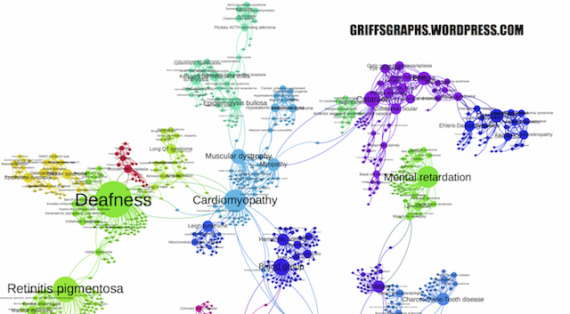
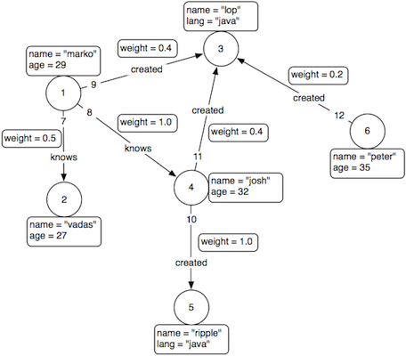
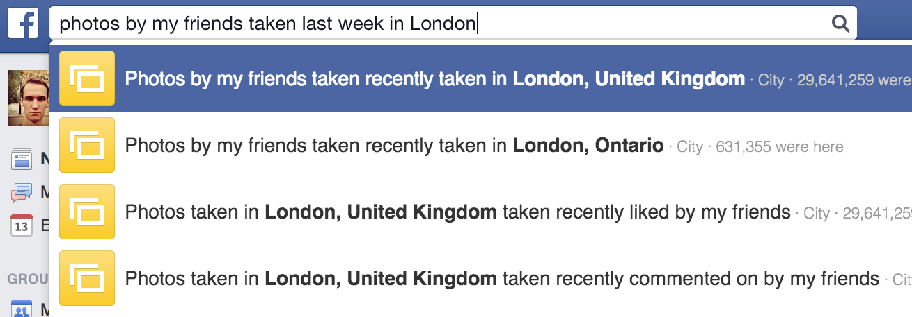
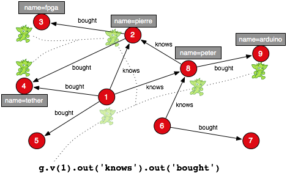
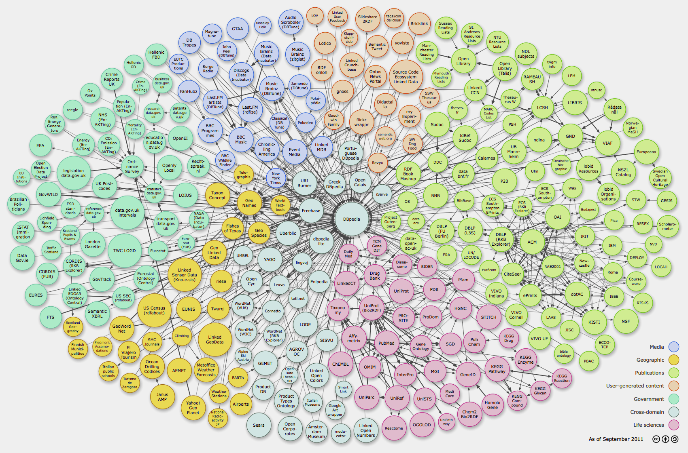

# Intro

-----

### What is Scarph

> "Scarph is not a scarf, it's a Scala garph"

Actually, it is an **embedded domain specific language** for accessing **graph databases** and building queries in a **type-safe manner**


-----

### Why it is useful

- a lot of information in the databases
- it's structured and highly interconnected
- we need to make some sense of it!


-----

### Why it is innovative

- you define graph schema
    + your queries conform to it
- solid theoretical foundation
    + _dagger categories_
    + _monoidal_ (even twice!) and _compact closed_


# Graph databases

-----

### Networks and graphs

- they are everywhere!
- it's just nodes and relationships
- social networks: Twitter, Facebook, Linkedin
- protein interaction networks, etc.



<aside class="notes">
  - Graph database is a technology for data storage using graph structures, so that every element is directly linked to its neighbor element.
  - Graphs and networks surround us everywhere and are extremely useful for representing connected data.
</aside>

-----


### Bio4j data platform

<!--  -->

- A lot of protein related data:
    - Uniprot KB (SwissProt + Trembl)
    - Gene Ontology (GO)
    - UniRef (50,90,100)
    - NCBI Taxonomy
    - Expasy Enzyme DB
- Amazon Web Services infrastructure
- TitanDB backend

See [`bio4j.com`](http://bio4j.com)


-----

### Property graph model

- labeled **vertices**
- labeled directed **edges** connecting vertices
- **properties** attached to vertices or edges



<aside class="notes">
  - How data is modeled in graph DBs
  - Props are like edges
</aside>


# Graph query languages

-----

### What's a graph query



<aside class="notes">
  - social network is a graph (people, photos, friendship)
  - querying = traversing graph
</aside>


-----

### The zoo of languages

- SPARQL for RDF
- Cypher (only) for Neo4j
- Gremlin for anything Blueprints-compatible
- Pixy --- Prolog on top of Gremlin



<aside class="notes">
  - high diversity => no common foundation
  - all with diff features, but all aim to traverse graphs
  - they all treat graph without it's schema
</aside>


-----


-----




# Scarph features

-----

### Scarph is an EDSL

EDSL = Embedded Domain Specific Language

- implemented in Scala
- any code in Scarph is just Scala code!
- takes advantage of its advanced type system
- flexible & extensible


-----

### Defining graph schema in Scarph

```scala
object user extends Vertex {
  object name extends Property(user → String)
  object age  extends Property(user → Number)
}

object tweet extends Vertex {
  object text extends Property(tweet → String)
  object url  extends Property(tweet → URL)
}


object follows extends Edge(ManyOrNone(user) → ManyOrNone(user))

object posted extends Edge(ExactlyOne(user) → ManyOrNone(tweet)) {
  object time extends Property(posted → Date)
}
```


-----

### Static queries

- you can _write_  queries in one place
- but _execute_ them in another!
- you can _reuse_ them
- you can _rewrite_ them
- and they always _conform to the schema_


-----

### Pluggable syntax

> "get text of the tweets posted by someone's followers"

```scala
// arrows syntax
user <--(follows)--< user >--(posted)--> tweet.text
```

```scala
// flow syntax (Gremlin-like)
user.inV(follows).outV(posted).get(tweet.text)
```

```scala
// core syntax
inV(follows) >=> outV(posted) >=> get(tweet.text)
```


-----

### Independent implementations

- Different graph database technologies:
    + **TitanDB**
    - Neo4j
    - OrientDB
    - DEX/Sparksee
    - Bigdata
    - Bitsy
- `scarph-titan` is (almost) ready to use!


-----

### Query rewriting

- generic simplifications:
    + `A ⊗ I` is just `A`
    + `f >=> id` is just `f`
    + `(f ⊗ g).leftProj` is just `f`
- implementation and data-specific optimizations
- user-defined rewriting strategies


# Bio4j + Scarph = 😊

-----

### Bio4j schema


-----

### Bio4j schema


-----

### `github.com/bio4j/bio4j-scala`

```scala
val assemblySequences =
  assembly <--<(contigAssembly)<--< contig |>>|
  contig >-->(contigSequence)>--> sequence
```

```scala
val allAssembliesFromScaffold =
  scaffold >-->(scaffoldContigs)>--> contig |>>|
  contig >-->(contigAssembly)>--> assembly
```

```scala
val annotationsOverSequencesOfType =
  sequenceType <--<(hasSequenceType)<--< sequence |>>|
  sequence <--<(annotationInterval)<--< annotation
```


# Conclusion

-----

### Current state of the work

- Scarph query language is implemented and will be released soon
- TitanDB implementation of Scarph is almost ready
- integration of Scarph and Bio4j is in progress
- working on a theoretical paper about dagger categories for graph databases and query languages
- working on a technical paper about Scarph

-----

### Future work

- testing and benchmarking
- writing documentation
- more implementations  
  (OrientDB, DynamoDB, Neo4j?)
- interactive query console
- query visualization and visual editing


-----

### Thanks for attention

- sources:
    + <https://github.com/ohnosequences/scarph>
    + <https://github.com/ohnosequences/scarph-titan>
- discussion:
    + <https://gitter.im/ohnosequences/scarph>
    + <aalekhin@ohnosequences.com>


# Scarph morphisms

-----

### Vertex incoming/outgoing edges

|           |                       |
|----------:|:---------------------:|
| `outV[E]` | `E#Source → E#Target` |
|  `inV[E]` | `E#Target → E#Source` |

where `E` is any edge


-----

### Get element property & lookup element by property value

|             |                     |
|------------:|:-------------------:|
|    `get[P]` | `P#Owner → P#Value` |
| `lookup[P]` | `P#Value → P#Owner` |

where `P` is any property


-----

### Dagger categories

$†: \mathbf{C^{op}} → \mathbf{C}$:  
for every $f: A → B$, $f^†: B → A$

- $f^{††} = f$,
- $id^†_A = id_A$,
- $(g ∘ f)^† = f^† ∘ g^†$.

-----

### Symmetric monoidal structure

$(\mathbf{C}, ⊗, I)$

- parallel computation
- diagonal & codiagonal maps:
    + $△: A → A ⊗ A$
    + $▽: A ⊗ A → A$


-----

### Tensor diagonal & codiagonal (`△` & `▽`)

|                |             |
|---------------:|:-----------:|
| `duplicate[X]` | `X → X ⊗ X` |
|   `matchUp[X]` | `X ⊗ X → X` |

where `X` is any object


-----

### Compact closed structure with self-duality

Every object $A ∈ \mathbf{C}$ is equipped with

- $A^* = A$
- $η_A: I → A ⊗ A$
- $ε_A: A ⊗ A → I$


-----

### From/to unit

|               |            |
|--------------:|:----------:|
| `fromUnit[X]` | `unit → X` |
|   `toUnit[X]` | `X → unit` |

where `X` is any object and `unit` is the whole graph


-----

### Biproduct structure

$(\mathbf{C}, ⊕, 0)$

- computation with choice:  
  $A ⊕ B$ is "maybe $A$ _and_ maybe $B$"
- diagonal & codiagonal maps:
    + $δ: A → A ⊕ A$
    + $ε: A ⊕ A → A$
- trace $\operatorname{Tr}^X_{A, B}:\mathbf{C}(A ⊕ X, B ⊕ X) → \mathbf{C}(A, B)$  


-----

### From/to zero

|               |            |
|--------------:|:----------:|
| `fromZero[X]` | `zero → X` |
|   `toZero[X]` | `X → zero` |

where `X` is any object

-----

### Biproduct diagonal & codiagonal

|            |             |
|-----------:|:-----------:|
|  `fork[X]` | `X → X ⊕ X` |
| `merge[X]` | `X ⊕ X → X` |

where `X` is any object

-----

### Biproduct injections/projections

|                  |             |
|-----------------:|:-----------:|
|  `leftInj[A, B]` | `A → A ⊕ B` |
| `leftProj[A, B]` | `A ⊕ B → A` |

|                   |             |
|------------------:|:-----------:|
|  `rightInj[A, B]` | `B → A ⊕ B` |
| `rightProj[A, B]` | `A ⊕ B → B` |

where `A` and `B` are any objects


-----

### Combining morphisms

- composition: `f >=> g`
- tensor product: `f ⊗ g`
- biproduct: `f ⊕ g`
